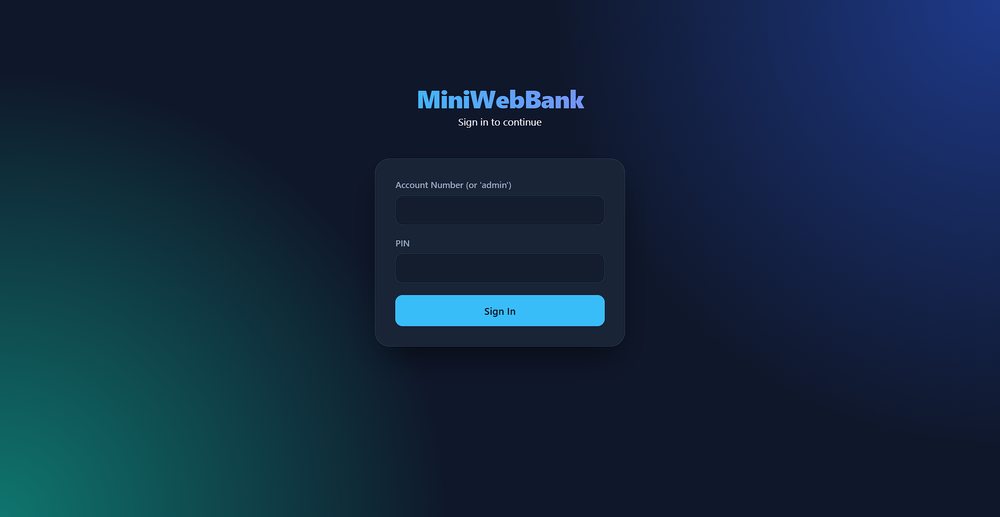
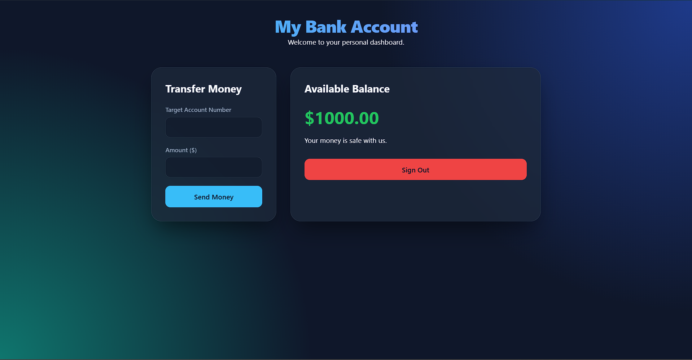
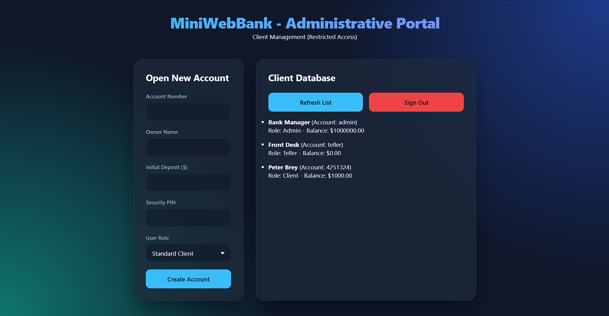
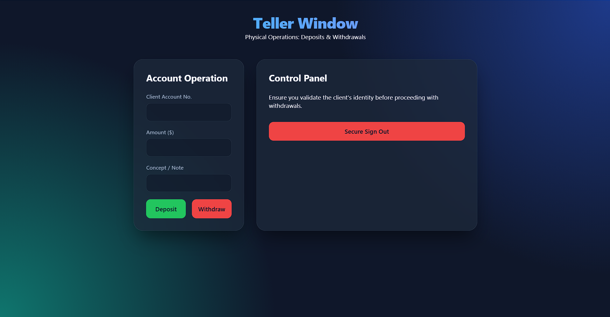
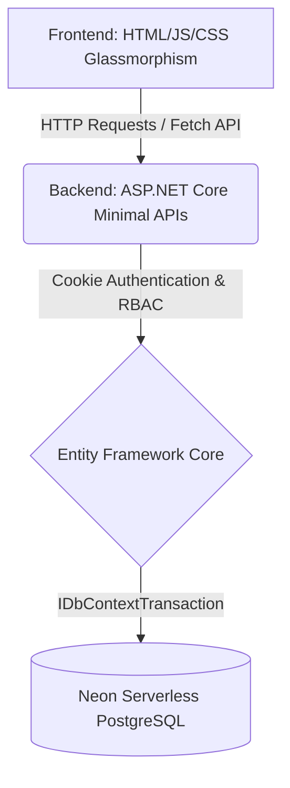

# MiniWebBank (Full-Stack Banking App)

A production-grade banking application built with **C# ASP.NET Core** and **Vanilla JavaScript**, designed as a portfolio showcase demonstrating modern backend architecture and secure web practices.

## Screenshots

| Login Portal | Home Banking (Client) |
|---|---|
|  |  |

| CRM (Admin) | Teller Window |
|---|---|
|  |  |

*(Note: Replace the placeholder URLs above with actual screenshots placed in a `screenshots` folder).*

## Architecture Overview



## Key Learnings & Features

- **Role-Based Access Control (RBAC):** Implemented strict authorization with three distinct levels (`Admin`, `Teller`, and `Client`), ensuring endpoints like withdrawals can only be accessed by bank employees.
- **Database Transactions (ACID):** Developed a robust transfer system using `IDbContextTransaction` to guarantee atomic operations (preventing money loss during partial failures).
- **Authentication with Claims Identity:** Transitioned from insecure client-side validation to encrypted ASP.NET Core Session Cookies.
- **PostgreSQL Cloud Deployment:** Successfully migrated from a local SQLite database to a fully managed Serverless PostgreSQL cluster hosted on AWS via Neon Tech.
- **Entity Framework Core:** Utilized EF Core as the ORM to bridge object-oriented code with relational database tables efficiently.
- **Decoupled Frontend:** Applied Single Responsibility Principle (SRP) to the frontend architecture, splitting views by roles (`index.html`, `admin.html`, `teller.html`, `dashboard.html`).

## Technologies Used
- **Backend:** C# 11, .NET 8, ASP.NET Core Minimal APIs
- **ORM:** Entity Framework Core
- **Database:** PostgreSQL (Neon Tech / AWS)
- **Frontend:** HTML5, CSS3, Vanilla JavaScript (Fetch API)

## API Endpoints Showcase

Here is a glimpse of the core REST endpoints developed for the system:

| Endpoint | Method | Role Required | Description |
|---|---|---|---|
| `/login` | `POST` | None | Authenticates user and issues a secure session Cookie. |
| `/accounts` | `GET` | **Admin** | Retrieves all registered bank accounts. |
| `/accounts/me` | `GET` | Authenticated | Retrieves current balance for the logged-in user. |
| `/accounts/{number}/deposit` | `POST` | **Admin, Teller** | Deposits physical money into an account. |
| `/accounts/transfer` | `POST` | Authenticated | Performs an atomic transfer between two accounts. |

## 🚀 How to Run Locally
1. Clone this repository.
2. Ensure you have the .NET SDK installed.
3. Set up your Neon PostgreSQL connection string using .NET user-secrets.
4. Run the following command in the terminal:
   ```bash
   dotnet run
   ```
5. Open `http://localhost:5025/index.html` in your browser.
